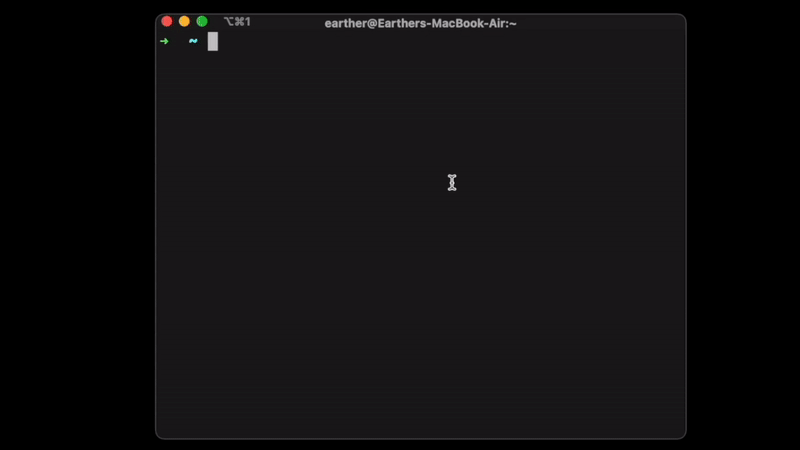
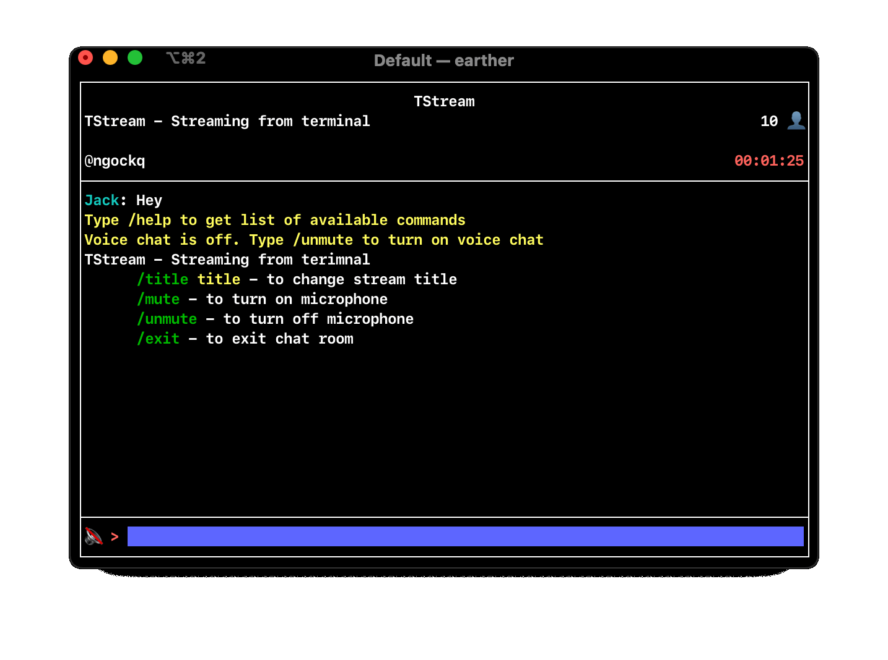
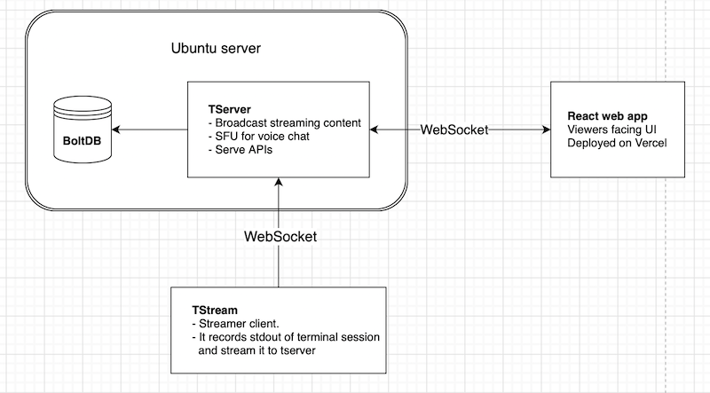

<h1 style="border-bottom:0" align="center">TStream - Streaming from terminal</h1>
<a href="https://tstream.club">

</a>

<a href="https://tstream.club">TStream.club </a> | <a href="https://discord.gg/qATHjk6ady"> Join our Discord </a> | <a href="https://tstream.club/start-streaming">Start Streaming</a>

# Install
## Download pre-built package
The easiest way to install `tstream` is download it form our [Release](https://github.com/qnkhuat/tstream/releases) page. Make sure you download the version that match your Operating System
- Unpack it with command: `tar -xzf tstream_{version}_{os}_{arch}.tar.gz`
- Setup TStream to run it anywhere: `cp tstream /usr/local/bin`

## Build from source
- Install the [Go toolchain](https://golang.org/dl/)
- Clone the project: `https://github.com/qnkhuat/tstream`
- Cd to tstream source code: `cd tstream/`
- Build: `go build cmd/tstream.go`
- Setup TStream to run it anywhere: `cp tstream /usr/local/bin`

# Start Streaming
Just type `tstream` in the terminal and it will instruct you 🙂

### (Optional) Tstream chat inside terminal
We also have a chat client on terminal, you can start it with `tstream -chat` after you've started your streaming session

### (Optional) Voice chat 🔈
Inside TStream chat client, you can turn on voice chat with command `/unmute` and turn off it with `/mute`

# Self Host
This diagram is an overview of all needed components to run TStream

## TServer
The easiest way to install `tserver` is download it from our [Release](https://github.com/qnkhuat/tstream/releases) page

Or if you prefer to build from source
- Clone the repo `git clone https://github.com/qnkhuat/tstream`
- Install the [Go toolchain](https://golang.org/dl/)
- Run `cd tstream/tstream && go run cmd/server`

Optional configurations:
- `-host localhost:3000`: Address to server tserver. Default is `localhost:3000`
- `-db .db`: path to BoltDB file. This DB is used to store data like: finished streaming. Default is `$(pwd)/.db`

Test the server with `curl http://localhost:3000/api/health`. It should return the current time

## Client web app
This is what currently running at [tstream.club](https://tstream.club). 

To run it:
- Install [nodejs](https://nodejs.org/en/download/)
- Clone the repo: `git clone https://github.com/qnkhuat/tstream`
- cd to the client folder: `cd client/`
- Install dependencies: `npm install`
- Tell the client your the server address by: `export REACT_APP_API_URL={your server address}`
- Run server: `npm run start`

Now go to `localhost:3001`, it should be exactly like [tstream.club](https://tstream.club)

For production I recommend using service like [Vercel](https://vercel.com/). It's free and very easy to setup

## Streaming 

By default the tstream package will stream to [https://server.tstream.club](https://server.tstream.club)

You can override it with by running `tstream -server {your server address}`. 

For example : `tstream -server http://localhost:3000`

# Upcoming features
- [x] One command to stream terminal session to web => just like tty-share
- [x] In room Chat
- [x] Voice chat
- [ ] Stream playback
- [ ] Private session
- [ ] Multiple tabs support
- [ ] User management system

